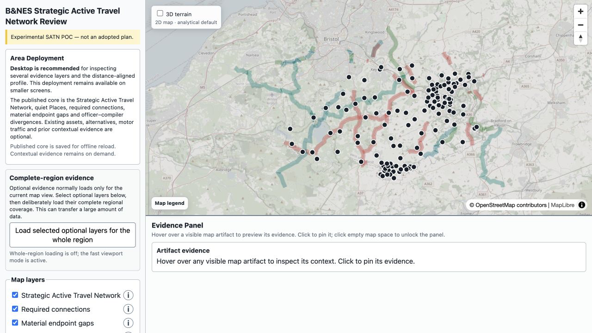
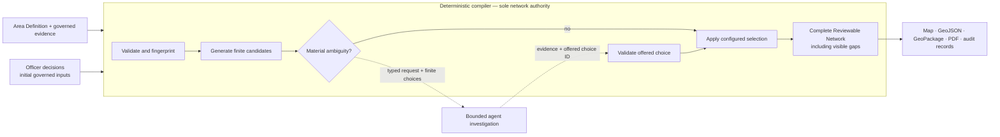

# Agentic SATN Compiler

Build an inspectable Strategic Active Travel Network from governed evidence, explicit
planning rules and bounded human or AI choices.

> Experimental proof of concept — not an adopted plan, scheme design, safety audit,
> legal-access finding or investment case.

[Open SATN Deployments](https://awjreynolds.github.io/agentic-satn-compiler/),
[explore the B&NES example](https://awjreynolds.github.io/agentic-satn-compiler/deployments/banes/)
or [build your first local map](docs/getting-started/agent-quickstart.md).



## Why this compiler is different

| Feature | What it gives a reviewer |
| --- | --- |
| **Reuse-first route selection** | Existing cycle provision, current and reclassified NCN, Greenways, PROWs and governed local links stay visible and can be preferred through configuration instead of hidden engine rules. |
| **Intervention-legible network** | Route cores distinguish existing provision, upgrade required and proposed new links. Halos show the physical Alignment Basis, so the map explains both what is followed and what must change. |
| **Alternatives remain inspectable** | Existing assets and candidates do not disappear when unselected. Officer/compiler divergence is highlighted rather than silently overwritten. |
| **A map always comes back** | Valid inputs produce a Reviewable Network. Missing evidence and broken continuity remain explicit Network Gaps; the compiler does not invent a route or fail merely to avoid an incomplete result. |
| **Bounded AI, deterministic authority** | An agent may investigate a typed evidence request or choose from a finite compiler-authored menu. It cannot add geometry, manufacture facts, change policy or publish. |
| **Reproducible evidence and decisions** | Snapshots, profiles, choices and outputs are fingerprinted. One run produces an interactive map, GeoJSON, GeoPackage, PDF and audit/provenance records. |
| **Portable local compilation** | The same code and data contracts work for a small fixture, a council and a regional network without requiring a hosted backend. |

[See the features in the B&NES map →](docs/concepts/feature-tour.md)

## The authority boundary in one picture



The compiler creates geometry and applies policy. The agent never does. If evidence is
missing or a decision is unresolved, compilation retains the limitation and still
produces a reviewable result.

## Five-minute local map

Requires Python 3.12+ and [uv](https://docs.astral.sh/uv/).

```shell
git clone https://github.com/awjreynolds/agentic-satn-compiler.git
cd agentic-satn-compiler
uv sync --frozen --all-groups
uv run satn snapshot examples/fixture/council.yaml
uv run satn compile examples/fixture/council.yaml
uv run python -m http.server 8000 --directory examples/fixture/work/output/review-map
```

Open <http://localhost:8000>. The deterministic fixture produces two connections, no
gaps and a complete set of publication artifacts without downloading external map
data. Follow the [agent quickstart](docs/getting-started/agent-quickstart.md) for
machine-checkable success tests, then reproduce the full
[B&NES example](docs/guides/reproduce-banes.md).

## Documentation

- [Documentation index](docs/README.md)
- [Agent quickstart](docs/getting-started/agent-quickstart.md)
- [B&NES golden-path reproduction](docs/guides/reproduce-banes.md)
- [Build a new area](docs/guides/build-a-new-area.md)
- [Feature tour](docs/concepts/feature-tour.md)
- [Compiler and pipeline architecture](docs/compiler-architecture.md)
- [Area Definition reference](docs/reference/area-definition.md)
- [Generated artifact reference](docs/reference/artifacts.md)
- [Package and publish a deployment](docs/guides/publish-a-deployment.md)
- [Troubleshooting](docs/troubleshooting.md)
- [Project background and detailed legacy reference](docs/reference/project-background.md)

## Current status

The published maps use **Deterministic Test Mode** (`provider: fake`). No live AI model
was called. The substitute response passes through the same request, validation and
restart boundary, proving the control flow without claiming production AI assurance.

B&NES is the canonical quality example for this repository. Its generated network is
a planning hypothesis for officer review. Every alignment still requires the
appropriate engineering, land, legal, accessibility, safety and consultation work.

Released under the MIT licence. Derived data retains the attribution and licence of
its governed sources, including OpenStreetMap/ODbL and applicable Open Government
Licence sources.
