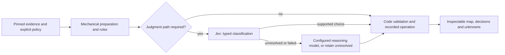

# Agentic SATN Compiler

Build and inspect a proposed **Strategic Active Travel Network (SATN)** from
sourced road and cycle-route evidence, explicit planning rules and attributable
human or AI decisions.

The current implementation is the **native Rust compiler** in [`rust/`](rust/README.md).
It prepares routes mechanically, uses the Jev classifier for alignment choices,
and can refer unresolved judgments to a configured reasoning model. Code validates
and records every applied choice. Planning officers retain policy and adoption
authority; a selected route is a proposal, not proof of safety, legal access or
scheme feasibility.

[Open the published maps](https://awjreynolds.github.io/agentic-satn-compiler/)
· [Understand the decisions and rules](docs/concepts/decision-process.md)
· [Build and run the native compiler](rust/README.md)

## For planning and transport readers

The map separates the strategic network from community connections, source
context and, where supplied, an illustrative officer network. Current and former
National Cycle Network (NCN) evidence retains its source designation; that label
alone does not establish present condition or cycling quality. Schools, bus
routes and candidate neighbourhoods provide context without automatically becoming
strategic route obligations.

Inspect a route's reason, decision origin, source evidence and unknowns together.
Mechanical computation, AI judgment and officer authority are different things.
An officer scenario applies explicit choices and rebuilds dependent community
connections, while retaining the compiler baseline for comparison. An illustrative
ATM-derived scenario does not imply council approval of this generated network.

Read the [map feature tour](docs/concepts/feature-tour.md) and the
[plain-language decision guide](docs/concepts/decision-process.md).

## For AI and software readers


```mermaid
flowchart LR
    inputs["Pinned evidence and explicit policy"] --> code["Mechanical preparation and rules"]
    code --> choice{"Judgment path required?"}
    choice -- no --> validate["Code validation and recorded operation"]
    choice -- yes --> jev["Jev: typed classification"]
    jev -- supported choice --> validate
    jev -- unresolved or failed --> specialist["Configured reasoning model, or retain unresolved"]
    specialist --> validate
    validate --> output["Inspectable map, decisions and unknowns"]
```

A model chooses within an admitted task; it does not draw executable routes or
supply missing observations. Search weights generate alternatives, not a universal
quality score. The rural-access path resolves sole or evidentially dominant options mechanically;
the current live town/city loop asks Jev for each prepared connection. Replay
uses recorded operations without calling a model; fresh inference can differ.

The [decision guide](docs/concepts/decision-process.md) documents the mechanical
rules, escalation conditions and attribution. The [architecture](docs/compiler-architecture.md)
connects them to code, history and publication.

## Build a local native map

Requires Rust, CMake and a C++ compiler, plus the pinned source snapshot referenced
by the Area Definition. A clone does **not** include the real-world source cache.
From the repository root:

```sh
cargo build --release --manifest-path rust/Cargo.toml --locked
./rust/target/release/satn-rs \
  --config deployments/banes/area.yaml \
  --output build/rust-banes \
  --mode mechanical
```

This produces a mechanical source/candidate map, not a live AI-selected network.
See the [native instructions](rust/README.md) for live decisions, offline replay,
officer scenarios, input preparation and output files. Model use needs the
[per-run approval described in the operations guide](docs/guides/native-clean-build.md).
If `CARGO_TARGET_DIR` is set, use its `release/satn-rs` binary instead.

For a small installation fixture without real-world data acquisition, the
[retained Python fixture](docs/getting-started/agent-quickstart.md#retained-python-fixture) remains available.
It exercises the retained Python compiler, not the native implementation.

## Implementation and documentation status

| Path | Status and purpose |
| --- | --- |
| Native Rust compiler | Current development and native network publication path; mechanical preparation, classifier/specialist decisions, replay, community access and officer scenarios. |
| Python TypeSafe planner | Retained experiment and evidence for the three decision classes; its history format and CLI are separate from Rust. |
| Earlier Python `satn compile` | Retained Schema 2.0 workflow, including its own GIS/PDF artifacts and fake-runtime fixtures. |
| Source-baseline builder | Separate evidence-only map utility; it does not execute network planning or AI. |

As checked on 30 September 2026, `main` and the latest successful Pages release
use revision `bba7402`; the release is
[`asatnc-ncn-label-provenance-2026-09-29`](https://github.com/awjreynolds/agentic-satn-compiler/releases/tag/asatnc-ncn-label-provenance-2026-09-29).
A release may reuse earlier planning receipts. Its code revision does not mean
new inference ran, and model attribution must be read from the relevant history.
Historical screenshots and experiment results are labelled in their own guides.

## Documentation and development

- [Documentation index](docs/README.md): current operations and historical references.
- [Mechanical rules and AI decisions](docs/concepts/decision-process.md).
- [Compiler architecture](docs/compiler-architecture.md) and [domain language](CONTEXT.md).
- [Native build and CLI](rust/README.md), [elevation preparation](docs/guides/native-clean-build.md), and [publication](docs/guides/publish-a-deployment.md).
- [Contributing](CONTRIBUTING.md): use focused checks appropriate to the changed path.
- [Issue reconciliation](docs/planning/issue-status-2026-09-30.md): implemented, superseded and remaining work.

Released under the MIT licence. Derived data retains its source attribution and
licence, including OpenStreetMap/ODbL and applicable Open Government Licence data.
