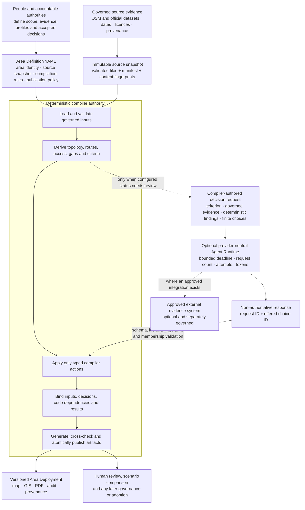
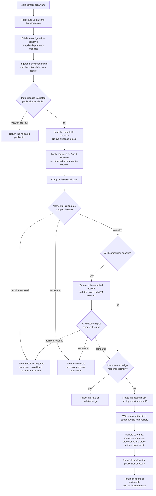
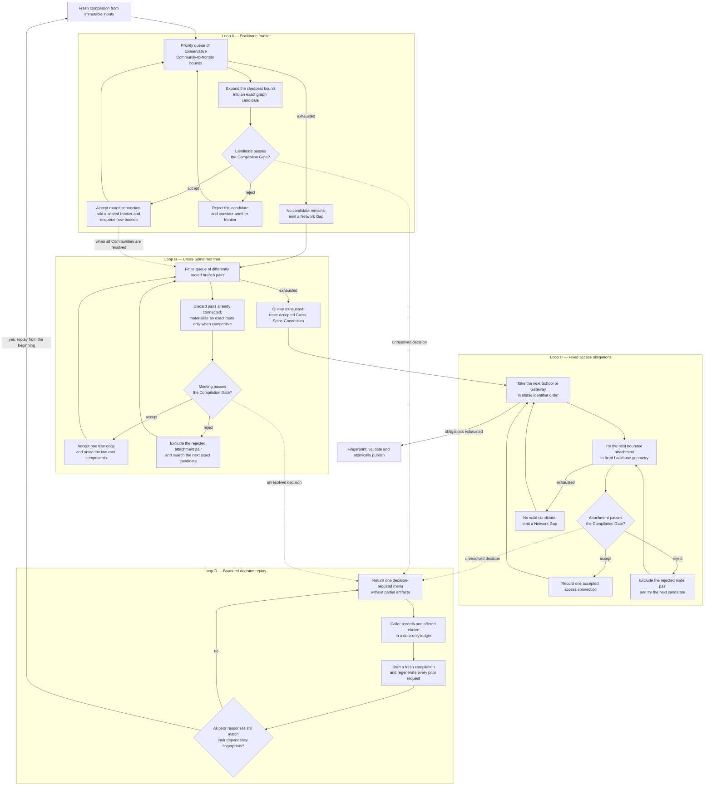
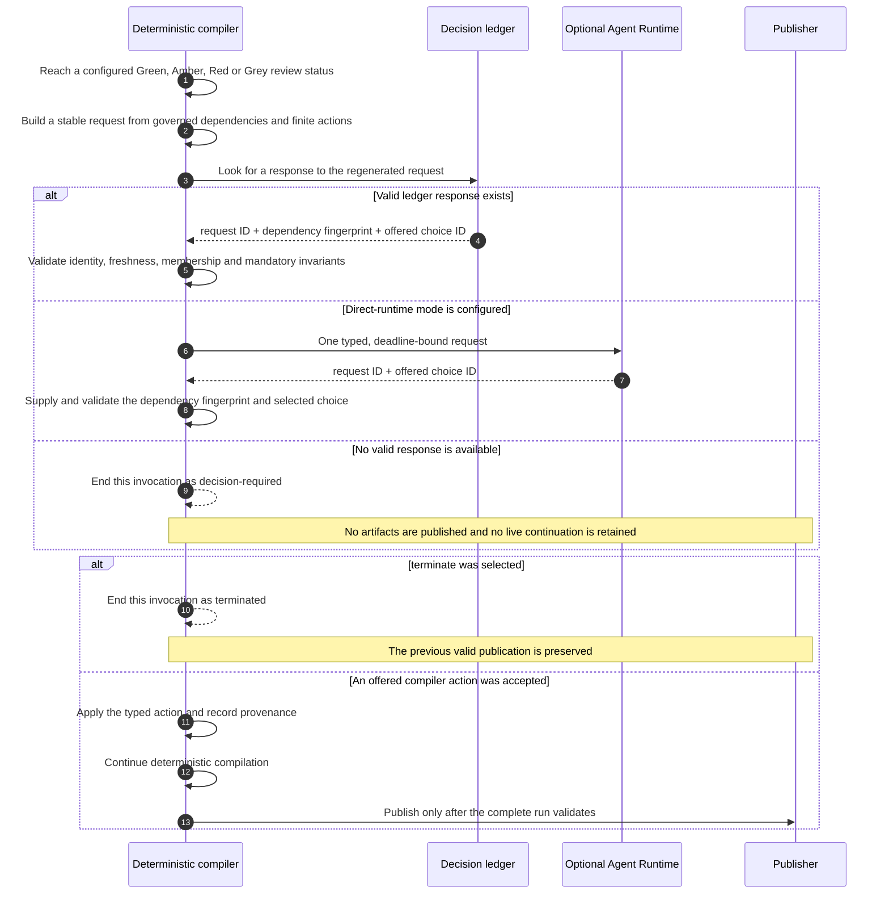
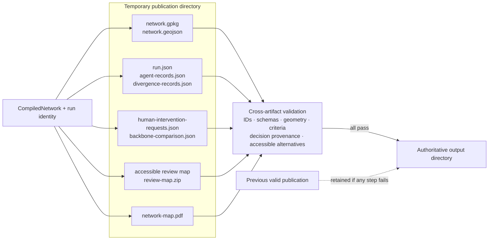
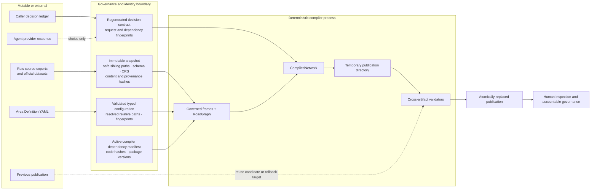

# How the Agentic SATN Compiler works

The Agentic SATN Compiler is a deterministic geospatial compiler with bounded
decision points. It turns governed evidence and explicit planning rules into one
versioned, inspectable Strategic Active Travel Network. An optional agent can
investigate or select from compiler-authored actions, but only the compiler can
change network state or publish artifacts.

This page describes the ordinary `satn compile` path in Schema 2.0. The diagrams are
Mermaid source rendered natively by GitHub, so the architecture stays reviewable and
version-controlled alongside the implementation.

## 1. System boundary



The solid path is authoritative and deterministic. The dashed path is optional and
non-authoritative. No edge runs from the Agent Runtime to geometry, policy, lifecycle
state or publication.

The published B&NES and West of England proofs of concept use Deterministic Test Mode
(`provider: fake`). They exercise this boundary reproducibly without calling a live
model or external evidence system.

## 2. One complete compilation



A compilation is fail-closed:

- a missing, stale, malformed or unknown decision never produces partial artifacts;
- a failed artifact or cross-artifact validation never replaces the last valid
  publication;
- changing governed evidence, configuration, accepted decisions or an active compiler
  dependency changes the compilation identity; and
- an unchanged input may reuse only a complete publication that still passes current
  validation.

## 3. What the network core derives

```mermaid
flowchart TD
    inputs["Snapshot frames<br/>boundary · places · road network · context · governed evidence"]
    govern["Govern official road classification,<br/>Community eligibility and urban/rural scope"]
    graph["Mark recognised cycle-route edges<br/>and build the bidirectional RoadGraph"]
    split["Identify Communities, Schools,<br/>Cross-Boundary Gateways and Strategic Spines"]

    subgraph rural["Rural Backbone-Outward Assembly"]
        seeds["Seed one concurrent frontier<br/>from every governed Strategic Spine"]
        remain{"Unserved rural<br/>Communities remain?"}
        nearest["Select the globally nearest reachable<br/>unserved Access Obligation"]
        branch["Create or extend a routed branch<br/>over continuous graph geometry"]
        meetings["Join differently rooted branches<br/>at their first validated meeting"]
        connectors["Trace Cross-Spine Connectors<br/>through both parent lineages"]
        school["Attach rural Schools to fixed backbone geometry<br/>without making Schools routing frontiers"]
        gateway["Attach Cross-Boundary Gateways<br/>to the served frontier"]
        ruralgaps["Expose unreachable obligations<br/>as point-only Network Gaps"]

        seeds --> remain
        remain -- "yes" --> nearest --> branch --> remain
        remain -- "no reachable candidate" --> ruralgaps
        remain -- "growth complete" --> meetings --> connectors --> school --> gateway
        ruralgaps --> meetings
    end

    subgraph urban["Urban topology and access"]
        spines["Derive governed Urban Main-Road Spines"]
        areas["Derive Candidate Low-Traffic Areas<br/>and stable named portals"]
        community["Assess Urban Community access<br/>without inventing residential centrelines"]
        schoolaccess["Assess Urban School access<br/>from usable entrances to named portals"]
        schoolstreet["Produce qualitative School Street<br/>Candidate Assessments"]

        spines --> areas --> community --> schoolaccess --> schoolstreet
    end

    merge["Combine Strategic Spines, access branches,<br/>meetings, connectors, urban obligations and gaps"]
    terrain["Build directional Topography Profiles<br/>and stable Gradient Sections"]
    selection["Optionally prepare finite Network Selection<br/>candidates without mutating the compiled network"]
    criteria["Calculate inspectable criteria,<br/>coverage, warnings and diagnostics"]
    compiled["CompiledNetwork<br/>authoritative features + findings + provenance"]

    inputs --> govern --> graph --> split
    split --> seeds
    split --> spines
    connectors --> merge
    ruralgaps --> merge
    schoolstreet --> merge
    merge --> terrain --> selection --> criteria --> compiled
```

### Backbone-Outward Assembly

All governed Strategic Spines are available before growth begins. The compiler serves
the nearest reachable unserved rural Community by bidirectional cycling-network cost.
A Community may extend an existing branch rather than create another direct
spine attachment. Independently rooted branches can meet once in global cost order,
forming a tree instead of a dense pairwise mesh.

The resulting topology has explicit roles:

- **Strategic Spines** are the governed shared backbone;
- **Spine Access Connections** attach Access Obligations to that backbone or an
  established branch;
- **Spine Access Branches** preserve ownership, parentage and evidence;
- **Branch Meeting Connections** join differently rooted fronts;
- **Cross-Spine Connectors** trace the complete connection between Strategic Spines;
  and
- **Network Gaps** retain unresolved access or continuity instead of hiding it with
  invented straight lines.

### Urban network, Schools and terrain

The urban path represents connected low-traffic fabric as an area with named portals,
not as a falsely precise route through residential streets. Schools are Access
Obligations rather than peer routing destinations. Every generated network edge also
receives a directional Topography Profile; missing elevation remains explicit Grey
evidence rather than being interpreted as flat terrain.

Optional Network Selection preparation creates bounded, inspectable Alignment
Candidates from compiler-produced anchors and governed inputs. Preparation does not
itself select a Preferred Strategic Alignment or mutate the authoritative network.

## 4. Key loops within the compiler

The compiler is easier to understand as several finite loops with explicit exit
conditions, not one linear route-generation pass.



### Loop A: concurrent Community growth

Every Strategic Spine contributes initial frontier geometry. The compiler enqueues
bounded Community/frontier pairs in a priority queue, expands the cheapest still-live
bound into an exact RoadGraph route and evaluates the resulting candidate. Accepting
a connection creates a new served frontier and therefore new candidate bounds.
Rejecting it does not silently discard the Community; another governed attachment may
still win. Queue exhaustion converts every remaining Community into an explicit
Network Gap.

The loop is finite because its work is bounded by the finite snapshot graph,
Communities, frontiers and compiler-authored candidate relationships. Stable sorting
and ranks prevent source feature order from changing the authoritative result.

### Loop B: Cross-Spine tree formation

The compiler considers the finite set of pairs between differently rooted branch
groups. Cheap distance bounds defer exact route materialisation. A pair is skipped as
soon as accepted meetings already connect its roots. A rejected exact attachment is
excluded before the next candidate for that root pair is tried. An accepted meeting
unions the components.

This is Kruskal-like tree construction: it joins root components without adding
parallel or cyclic meetings. The final Cross-Spine Connector is traced through the
accepted meeting and both parent branch lineages; it is not a separate invented route.

### Loop C: Schools and gateways

After Community growth and Cross-Spine formation, each rural School is considered in
stable order against fixed spine, branch and connector geometry. Rejected attachment
node pairs are excluded and the next bounded candidate is tried. A School never
becomes a routing frontier for another School or Community. Cross-Boundary Gateways
are then attached to the existing served frontier. Exhaustion is always visible as a
Network Gap.

### Loop D: decisions across fresh runs

There is deliberately no suspended in-memory compiler waiting for an answer. A caller
may repeat the compile/ledger cycle several times as later decision points become
actionable. On every pass, the compiler reconstructs the network from immutable
inputs, regenerates prior requests and consumes only responses whose request identity,
dependency fingerprint and offered choice still match. The loop ends in a complete or
reviewable publication, explicit termination, or a currently actionable request.

Whole-publication reuse is a separate short circuit around these loops: it is allowed
only when the governed inputs, decision ledger, active compiler dependencies and
existing validated publication all match.

## 5. The agentic stop, validate and restart protocol



Caller mode is deliberately a fresh-run protocol, not a suspended process:

1. the compiler returns one actionable `decision-required` menu;
2. a caller records only the request ID, dependency fingerprint and offered choice
   ID in a data-only ledger;
3. the caller starts `satn compile` again with that ledger;
4. the compiler rebuilds from governed inputs, regenerates the same request and
   validates the response; and
5. only the compiler executes the action represented by that choice.

The ledger cannot carry code, geometry or free-form instructions. A caller ledger
takes precedence over direct runtime and prevents the runtime being constructed for
that resolved request. Runtime timeout, provider failure, malformed output, token
limit, request mismatch or unknown choice all collapse to the same safe
`decision-required` boundary.

## 6. Publication is one validated transaction



The compiler does not publish a map and later hope that its GIS and audit records
match. It constructs all formats from the same `CompiledNetwork`, validates the
temporary directory, then performs one atomic directory replacement. A failure
removes the temporary work and leaves the last valid publication in place.

The Area Deployment layer can then package these compiler artifacts into isolated,
progressively loaded public deployments with content-addressed evidence shards and a
tracked provenance lock. Hosting is an adapter; it is not part of network identity.

## 7. Inputs, trust boundaries and failure controls

This is a data-flow threat model for the compiler boundary. “Untrusted” does not mean
malicious by default; it means the compiler does not grant the input authority merely
because it exists on disk or came from an agent.



### Input inventory

| Input | Trust on arrival | Validation and binding | Permitted effect |
| --- | --- | --- | --- |
| Area Definition | Mutable local configuration | Typed schema, safe identifiers and paths, canonical relative-path identity, governed-input fingerprint | Selects area, snapshot, rules, optional features and publication policy |
| Raw source export | External evidence, governed by declared source authority | Bounded source adapter, schema/geometry checks, CRS handling, dates, licence, attribution and retained received-byte identity | Can enter a newly created immutable snapshot; ordinary compilation does not query it live |
| Snapshot manifest and files | Untrusted local bytes even when produced by an earlier run | Safe direct-child filenames, no links or traversal, exact file coverage, SHA-256 checks, schema/CRS/GeoJSON validation and optional retained-core lineage | Supplies the only ordinary compile-time evidence frames |
| Decision ledger | Untrusted caller data | Exact data-only contract, regenerated request ID, dependency fingerprint, offered-choice membership and rejection of unconsumed responses | Selects one already-authored compiler action |
| Agent Runtime response | Untrusted provider output | One typed request/attempt, hard deadline, token cap, output schema, matching request ID and offered-choice membership | Selects one already-authored compiler action; never supplies its implementation |
| ATM reference | Optional governed comparison evidence | Loaded in its configured mode and handled through the same bounded decision resolver | Produces comparison and divergence records; does not become silent geometry authority |
| Active compiler code and runtime distributions | Local execution dependency | Configuration-sensitive component hashes and installed versions are bound into the dependency manifest | Determines compiler semantics and invalidates reuse when an active dependency changes |
| Previous publication | Untrusted reuse candidate | Input identity, dependency manifest and current publication validators must all agree | May be reused; otherwise remains the rollback-safe prior result |
| Publication destination | Mutable filesystem path | Reject filesystem root, home, repository root, non-directory targets, symlink targets and symlink parents | Receives one validated atomic directory replacement |

### Failure and manipulation analysis

| Failure or manipulation | Control | Safe outcome |
| --- | --- | --- |
| Snapshot file is changed, omitted, duplicated, linked or addressed through traversal | Manifest coverage, safe-sibling resolution, regular-file checks and content/provenance hashes | Snapshot load fails before evidence frames are consumed |
| Configuration, evidence, accepted decisions or active compiler code changes | Governed-input, ledger, dependency and run fingerprints | Existing output is not silently reused; a new compilation identity is required |
| A disconnected graph, bad snap or absent two-way route cannot support a connection | Bounded attachment rules and continuous bidirectional RoadGraph routing | A visible point or route-refinement Network Gap replaces invented straight-line geometry |
| An agent or caller submits prose, geometry, an executable action, stale response or unknown choice | Closed response schema plus regenerated request, dependency and choice validation | `decision-required`; no partial publication |
| The provider times out, exceeds its token limit, returns malformed output or is unavailable | Hard in-process deadline, one request/attempt, token accounting and schema validation | `decision-required`; deterministic state is not mutated |
| A rejected candidate would make an obligation disappear | Candidate retry loops retain the obligation until another bounded option wins or the finite set is exhausted | Accepted alternative or explicit Network Gap |
| Cross-Spine search would create a mesh or repeat expensive routes unnecessarily | Root-component tree invariant, finite pair bounds and skip-if-connected rule | One acyclic set of accepted meetings; redundant pairs are not published |
| An unrelated or duplicate ledger response is smuggled into a later run | Canonical consumption tracking and final unconsumed-response rejection | Compilation fails instead of accepting ambiguous decision history |
| One artifact fails or formats disagree | All formats are generated in a temporary sibling and checked for schema, identity, geometry and provenance agreement | Temporary output is removed; previous publication remains |
| Publication targets an unsafe or overly broad filesystem location | Destination containment and symlink guards | Publication is rejected before replacement |
| A technically valid output is presented as adopted policy | Domain non-claims, separate governance lifecycle and external accountable decision requirements | Output remains a planning hypothesis, not democratic or officer authority |

### Residual trust and limits

The controls make execution reproducible and fail-closed; they do not prove that an
authoritative source is true, complete or current. SHA-256 provides content identity
and change detection, not a signature or publisher identity. Source selection,
licensing, interpretation and fitness remain governed human responsibilities.

The boundary also does not make a model unbiased, a routing rule correct, the local
host uncompromised or a planning hypothesis feasible on the ground. A compromised
compiler environment can undermine its own checks; algorithm quality still depends on
tests, review and domain challenge; a bounded agent can still choose poorly within its
menu; and provider unavailability can stop progress even though it cannot corrupt a
publication. Any future external imagery or evidence integration needs its own
licensing, privacy, provenance and human-verification controls.

## 8. Authority and non-claims

| Component | May do | May not do |
| --- | --- | --- |
| Governed configuration and evidence | Declare scope, source authority, profiles, rules and provenance | Silently change after snapshotting |
| Deterministic compiler | Derive geometry, topology, criteria, gaps, typed actions, fingerprints and artifacts | Create democratic or officer authority |
| Agent Runtime | Examine the bounded request and return an offered choice; approved future integrations may investigate governed external evidence | Invent executable geometry, add choices, write evidence, set policy, adopt a network or publish |
| Human or accountable authority | Accept evidence, create governed scenarios, record judgements and make formal decisions | Turn an unvalidated agent response into compiler state |
| Publisher | Render and validate consistent representations, then atomically replace the output | Publish a partial or internally inconsistent run |

The output is a reproducible planning hypothesis. It is not an adopted plan, detailed
scheme design, safety assessment, feasibility finding, business case, consultation
result or funding decision.

## 9. Implementation map

The diagrams are intentionally tied to a small set of source boundaries:

| Responsibility | Primary implementation |
| --- | --- |
| CLI entry point | [`src/satn/cli.py`](../src/satn/cli.py) |
| Snapshot creation and validation | [`src/satn/sources.py`](../src/satn/sources.py) |
| Compilation orchestration, fingerprints, reuse and result states | [`src/satn/pipeline.py`](../src/satn/pipeline.py) |
| Deterministic network core | [`src/satn/compiler.py`](../src/satn/compiler.py) |
| Backbone-Outward Assembly | [`src/satn/backbone.py`](../src/satn/backbone.py) |
| Bounded Agent Runtime and Compilation Gate | [`src/satn/agents.py`](../src/satn/agents.py) |
| Atomic artifact generation and validation | [`src/satn/publisher.py`](../src/satn/publisher.py) |
| Progressive Area Deployment packaging | [`src/satn/deployment.py`](../src/satn/deployment.py) |
| Domain vocabulary and non-claims | [`CONTEXT.md`](../CONTEXT.md) |

The governing architectural decisions are
[ADR 0001](adr/0001-lcwip-governance-authority-boundary.md),
[ADR 0002](adr/0002-bounded-staged-agent-authority.md),
[ADR 0003](adr/0003-atomic-cited-lcwip-publication.md),
[ADR 0005](adr/0005-isolated-progressive-area-deployments.md) and
[ADR 0010](adr/0010-configuration-sensitive-compilation-dependencies.md).

When the implementation changes one of these boundaries, update the corresponding
diagram in the same change. The aim is not to keep a marketing illustration current;
it is to keep a compact, reviewable model of the compiler beside its source.
