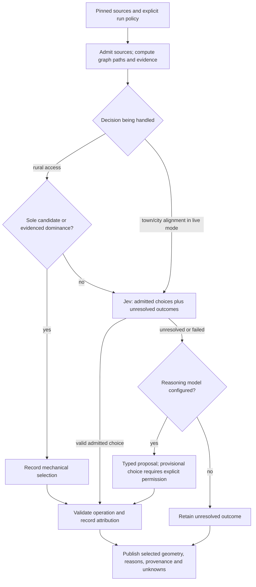

# How the compiler makes decisions

The current SATN compiler prepares a proposed active-travel network in Rust.
**Mechanical code calculates and checks; Jev classifies a focused choice; a
configured reasoning model can propose a resolution; people own policy and adoption.**
Those roles have different meanings even when their results appear on the same map.

For a planning reader, the useful questions are: which places does this connection
serve, what source evidence supports it, why was this alignment chosen, who or what
chose it, and what remains unknown? For an AI reader, the important boundary is
between deterministic facts, a model's interpretation, and code's authority to
apply a permitted operation. A model's confident answer cannot establish a missing
survey, legal right, safe crossing or council decision.

This guide describes `rust/` on `main` at `bba7402` (30 September 2026). The
[Python TypeSafe experiments](../typesafe-planning.md) and
[older Python compiler](../compiler-architecture.md#historical-implementations)
have different execution and storage contracts.

## The decision process

| Decision class | What performs it | Example | What it does not establish |
| --- | --- | --- | --- |
| `mechanical` | Deterministic rules and graph computation | Measure a path, deduplicate identical edge sequences, or select the sole rural-access candidate. | That a mapped route is safe, deliverable or adopted. |
| `classifier` | Jev through TypeSafe | Choose an admitted alignment, or return an explicit unknown/evidence-needed outcome. | A new observation or permission to change policy. |
| `agent` | A configured reasoning/specialist model | Propose a supported provisional choice with a reason and remaining uncertainty. | Wider authority than the original task or freedom to invent geometry. |

Officer authority is recorded separately. Code may mechanically apply an exact
officer binding without turning the officer's choice into an AI recommendation.
Similarly, mechanical validation of a model answer preserves its model origin.

**Implemented scope matters.** Mechanical-first is the design approach, but the
current live town/city loop sends each prepared connection to the classifier; it
does not implement a general mechanical bypass for equivalent urban choices.
The rural-access loop has the explicit mechanical shortcuts described below.
`--mode mechanical` (also `deterministic` at the CLI) prepares a source/candidate
report without invoking the decision mid-end. It is not a live-selected network
with AI simply switched off.

## Mechanical rules

### 1. Keep evidence, network membership and condition separate

The front end admits pinned source geometry and a directed graph. Every in-scope
A-road remains accounted for, including a source-only corridor that cannot attach
to the graph. Current/former NCN routes and existing cycleways retain their source
identities and strategic role. A-road classification, an NCN number or a mapped
cycleway is not evidence that every metre is presently suitable.

The source inventory, accepted alignment, community connection and map context
are distinct records. A justified departure retains the original source and its
reason; a missing connection remains a gap. Schools are informational in the
current strategic scope. An unconfigured strategic-destination profile remains
explicit rather than implying that all destinations are served.

Source: [`compiler.rs`](../../rust/src/compiler.rs),
[`ADR 0028`](../adr/0028-rust-mechanical-compiler-and-compact-decisions.md).

### 2. Generate alternatives without pretending to score quality

Prepared town/city connections come from observed adjacency in the routing graph.
For each connection, the implementation searches that graph with these role costs:

| Role | Implemented search cost |
| --- | --- |
| `direct` | Measured edge length. |
| `strategic-spine` | A-road-reference edge: `0.35 × length`; other edge: `1.6 × length`. |
| `ncn-informed` | Cycle-route-supported edge: `0.4 × length`; other edge: `1.3 × length`. |
| `low-traffic` | Eligible low-traffic highway class: `0.75 × length`; other edge: `4.0 × length`. |

These are the existing implementation's candidate-generation heuristics, not
recommended planning weights, statutory standards or classifier-confidence gates.
`length_m` remains measured length; `search_cost_m` is specific to the search role.
Comparing search costs across roles does not rank route quality. Identical **ordered
edge paths** are represented once with their additional roles in `role_aliases`;
equal length or nearby geometry is not enough to call routes equivalent.

If the direct search finds no route in either direction, the connection remains
admitted with no candidates; live classification then has only unresolved
outcomes to choose from. The compiler cannot manufacture a connection from that
answer.

The current town/city candidate search uses `Graph::route`, which does **not**
apply the explicit bicycle/access restriction filter. Rural frontier and onward
searches use the cycling-route variants that do filter explicit `no`/`private`
restrictions. Neither result is a legal-access determination. In particular, do
not interpret an urban candidate as a route already screened for cycle access.

Context-derived cycle-route binding uses the inherited **20 m buffer and at least
50% edge overlap** rule recorded in ADR 0028. It uses the declared gridless
WGS84-to-British-National-Grid transformation, not an OSTN15 accuracy claim. These
values describe that source-binding policy; they are not new selection tolerances.

Source: [`graph.rs`](../../rust/src/graph.rs),
[`compiler.rs`](../../rust/src/compiler.rs),
[`route tests`](../../rust/tests/routes.rs).

### 3. Grow shared community access from accepted routes

Rural access serves admitted villages and hamlets from an accepted strategic
frontier, useful source-backed urban entries and already accepted branches. The
compiler grows shared branches, distinguishing the new link length from the full
journey to its terminal. A deeper community can attach through a served community;
this is a constructive sharing policy, not proof of a globally optimal network.

Attachments use actual source-edge geometry, including partial directed edges.
Their inferred position and offset remain recorded; no surveyed entrance or
synthetic point-to-road connection is invented. Missing attachment stays a gap.
The next offer is the nearest reachable pending community by measured new-link
length, with deterministic identity/path tie-breaking. Where elevation evidence
is configured, the planner can prepare a lower-variation alternative by excluding
baseline edges and comparing complete-access profiles. It also retains supported
townward alternatives and deduplicates their paths. These are finite generated
options, not an exhaustive search of every possible network.

Only a path **selected and applied within the planner** expands the frontier for
later communities; this is not public adoption. An offered
alternative or unresolved parent does not count as a served route. A community
with no attachment or reachable admissible frontier becomes a mechanical unresolved
gap without asking a model to supply geometry.

A rural offer is mechanically selectable when:

- It has exactly one candidate; unknown condition can still remain attached.
- Or one candidate dominates every other candidate: it is no worse on every
  compared metric and strictly better on at least one.

Dominance needs finite, available evidence for new link length, full access length,
cumulative elevation variation and absolute sustained gradient. Estimated moving
time and hill-neutral time also participate when both compared candidates have
the relevant estimate. Missing evidence does not become zero; if dominance cannot
be established, code leaves the qualitative trade-off to the configured judgment
path. There is no combined distance/gradient score or confidence cutoff.

An already retained provider result is respected before a new mechanical shortcut
on resume. Replay uses the retained selected paths and parent relationships.

Source: `mechanical_rural_candidate`, `rural_dominates`, `rural_metrics` and
`run_rural_sequence` in [`midend.rs`](../../rust/src/midend.rs);
[`rural-access tests`](../../rust/tests/rural_access.rs) and
[`mid-end tests`](../../rust/tests/midend.rs).

### 4. Report terrain and time as evidence with assumptions

The compiler keeps measured route length, ordered ascent/descent, cumulative
height variation and sustained gradient separate. Endpoint height difference is
not cumulative climbing. Incomplete terrain remains unknown.

Moving time uses the explicitly named BRouter Trekking assumptions recorded in
[ADR 0028](../adr/0028-rust-mechanical-compiler-and-compact-decisions.md), with SATN's
terrain handling. It excludes stops, junction delay, acceleration and weather.
The separate hill-neutral sensitivity uses flat-ground speed on the same distance;
it is not an e-bike ETA. These estimates inform a choice without creating new
route-selection weights.

Source: [`topography.rs`](../../rust/src/topography.rs),
[`travel_time.rs`](../../rust/src/travel_time.rs).

### 5. Keep contextual inference within its scope

A candidate neighbourhood is inside a sourced built-up area and has positive-length
frontage on at least two distinct officially classified roads. A built-up boundary
can close its remaining sides. A point contact or two segments of the same road do
not satisfy the distinct-road test. The rule imposes no area-size threshold and
does not establish low traffic, internal connectivity or safe crossings.

The [neighbourhood guide](../guides/candidate-neighbourhoods.md) and
[`candidate_neighbourhoods.rs`](../../rust/src/candidate_neighbourhoods.rs) describe
this deterministic geometric rule. [Bus context](../guides/bus-route-overlay.md)
and school points likewise remain evidence layers, not automatic route choices.

## When the AI is asked

A task contains admitted candidates, relevant source facts, explicit unknowns,
applicable policy and relevant earlier decisions. Jev returns an offered choice
or `__unknown__`, `__needs_evidence__`, or `__none__`. The last three preserve an
unresolved semantic outcome; they do not erase a corridor or prove that no real
route could exist.

Code checks a selected candidate's binding to the task. There is **no numerical
confidence threshold** for accepting a route choice in this native decision path.
An arbitrary unoffered candidate is rejected; it is not a valid preference.

A missing result (including a failed request) or explicit unresolved marker can
escalate to the configured specialist in live mode. The failed classifier receipt
remains a failure even if the specialist later resolves the task. Invalid selected
candidate IDs do not automatically become an escalation request. If no valid
operation emerges, the decision stays unresolved.

A specialist selection requires explicit provisional permission (`--allow-provisional`),
`provisional: true`, an admitted candidate, a nonblank reason and retained nonblank
uncertainties. Without those, the compiler cannot apply that provisional selection.
A reasoned guess still does not establish provision, access or adoption.

Source: `classifier_operation`, `should_escalate`, `specialist_operation` and
`validate_operation` in [`midend.rs`](../../rust/src/midend.rs), with provider request
and response handling in [`judgment.rs`](../../rust/src/judgment.rs).
The [native CLI guide](../../rust/README.md) explains how to configure these modes.

## What people decide and what reviewers can reproduce

An officer scenario retains source references, attribution, rationale and exact
bindings. The effective officer network is applied before dependent community
connections are rebuilt. The original compiler network and officer network remain
separately inspectable. An unavailable or unmatched source cannot silently become
an applied decision; retained community judgments survive only where their
candidate and parent/root bindings still match.

Reviewers can inspect `planning.json`, the compact history and model receipts,
`decision-map.json`, `decision-map.geojson`, and any `officer-scenario.json` alongside
the map. A mechanical source/candidate run has a different artifact set. See the
[native instructions](../../rust/README.md) for the exact commands and outputs.

Recorded replay reproduces accepted operations without model calls. A new live
inference may differ. Branching preserves the chosen decision prefix and records
a new continuation. Neither successful replay nor a connected graph establishes
planning quality, deliverability or real-world safety: those remain evidence and
human-review questions.
