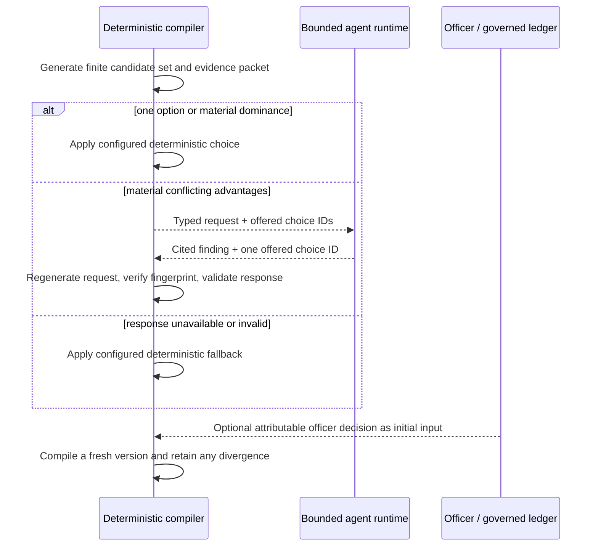
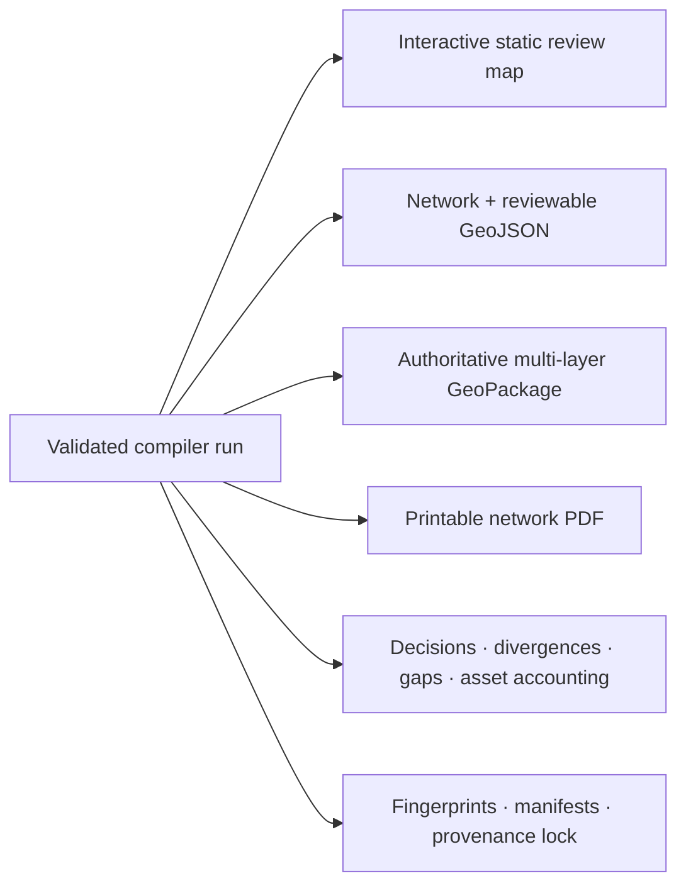

# Feature tour: what the B&NES map demonstrates

Start with the [live B&NES map](https://awjreynolds.github.io/agentic-satn-compiler/deployments/banes/).
It is a generated planning hypothesis, not an adopted network.

## 1. Read the strategic network before the evidence inventory

The initial view answers the first planning question: *what strategic network did the
compiler generate?* Strategic routes and quiet Places are visible; large evidence
inventories remain optional. Required connections, material endpoint gaps and
officer/compiler divergence stay prominent because they affect the meaning of the
network.

## 2. See what exists, what needs work and what is missing

A selected route carries two independent visual facts:

- **core line — intervention state:** existing provision, upgrade required or proposed
  new link; and
- **halo — primary Alignment Basis:** cycle track, shared path, NCN, PROW, former
  railway, local connector, road class or proposed corridor.

An unresolved gap is an endpoint finding, not a straight line pretending to be a
route. Patterns and text repeat colour meaning in the legend and evidence panel.

## 3. Reuse existing assets without hiding judgement

The configurable reuse-first profile can prefer existing cycle provision,
upgradeable off-carriageway assets and low-traffic non-A-road alignments before a
major-road protected-infrastructure option. That is a policy order, not an engine
constant or an unconditional winner.

Every governed asset remains in Asset Accounting. Optional layers show assets and
finite candidates that were not selected, including incomplete or topologically
unconnected opportunities. A route is not erased merely because it lost one exact
candidate-set decision.

## 4. Preserve officer authority and expose divergence

Officer decisions are initial governed inputs and do not expire. The compiler applies
them. When current evidence and configured policy indicate a materially different
choice, both remain visible as an officer/compiler divergence; neither is silently
turned into an anonymous grey route.

## 5. Finish even when the evidence cannot

Valid-input generation always completes as a **Reviewable Network**. A missing bridge,
unknown entrance, conflicted access claim or absent continuous route can produce:

- a Network Gap;
- an Evidence Request;
- a non-participation/disposition record; or
- a stated limitation on a selected candidate.

This is useful precisely because the map does not conceal work that still needs
survey, engineering, land, legal or officer attention.

## 6. Use AI without handing it the map

The agent cannot create geometry, add an unoffered option, reinterpret missing data as
fact, modify policy or publish. If the runtime changes or fails, the configured
fallback keeps generation finite and inspectable.

## 7. Take the result into other tools

One atomic run produces:

The [artifact reference](../reference/artifacts.md) explains which file to use for
review, GIS analysis, automation and assurance.
