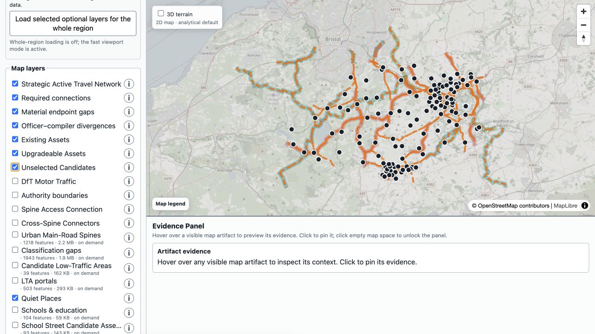
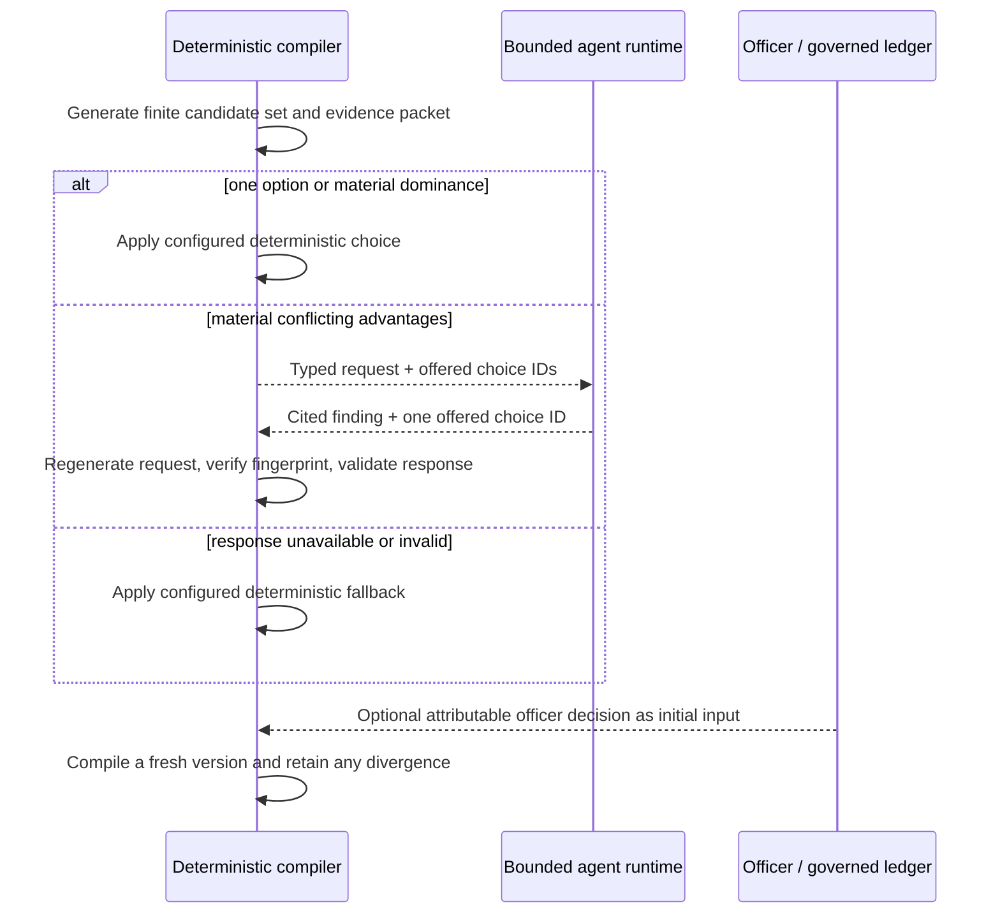

# Feature tour: what the B&NES map demonstrates

Start with the [live WECA map](https://awjreynolds.github.io/agentic-satn-compiler/deployments/weca/).
The screenshots below use the reproducible B&NES local example; every map is a
generated planning hypothesis, not an adopted network.

## 1. Read the strategic network before the evidence inventory

The initial view answers the first planning question: *what strategic network did the
compiler generate?* Strategic routes and quiet Places are visible; large evidence
inventories remain optional. Access connections, material endpoint gaps and
officer/compiler divergence can be inspected without changing the selected main
network.

The default shows **Strategic Main Network** and **Named places**. The main
network is the structural overview. **Access Support** separately shows the
connections serving Communities, Schools and destinations, including Cross-Spine
Connectors. Grouped optional controls let officers inspect evidence and alternatives
without making a first-time reader work through every diagnostic layer.

## 2. See what exists, what needs work and what is missing

The main overview uses a consistent structural line style. Enable **Alignment
review detail** to inspect two further visual facts about selected routes:

- **core line — intervention state:** existing provision, upgrade required or proposed
  new link; and
- **halo — primary Alignment Basis:** cycle track, shared path, NCN, PROW, former
  railway, local connector, road class or proposed corridor.

Gap markers show known endpoints or locations where main-network coverage is
missing. They retain the actual source locations without drawing a route across
the gap. Patterns and text repeat colour meaning in the legend and the map's compact
Review Lens.

Hover or keyboard-focus a visible feature for a short identification summary and
any published status. A separate highlight shows exactly which feature is being
inspected. Click or tap to keep its details in a stable panel, including available
connections, intervention information and recorded reasons. Technical identifiers
and source properties remain under a separate disclosure in this clicked view.
Network role alone is not a selection reason; missing explanations are not inferred.
Selecting a second
comparable line segment opens a two-segment view
with a display-only spider chart and the authoritative raw values beneath it.
Missing dimensions remain **Unknown**, and the chart does not calculate a winner or
feed route selection. Layer checkboxes only change visibility; their explanations
open only from the adjacent information control.

## 3. Reuse existing assets without hiding judgement

The configurable reuse-first profile can prefer existing cycle provision,
upgradeable off-carriageway assets and low-traffic non-A-road alignments before a
major-road protected-infrastructure option. That is a policy order, not an engine
constant or an unconditional winner.

Every governed asset remains in Asset Accounting. Optional layers show assets and
finite candidates that were not selected, including incomplete or topologically
unconnected opportunities. A route is not erased merely because it lost one exact
candidate-set decision.

The candidate menu is finite and compiler-authored. It can include a current
cycleway, Greenway, current or reclassified National Cycle Network section, public
right of way, former railway, governed local connector, classified road or proposed
corridor where the snapshot and profile support it. “Candidates discarded” means a
finite compiler-authored candidate or governed asset was not selected for this exact
candidate set; it does not mean deleted, unsafe or unavailable to a later governed
scenario. Incomplete, ineligible and topologically unconnected candidates retain
their identity, evidence and disposition for review.

An Alignment Basis describes what physical or corridor evidence a section follows;
it is not a route-quality score or a veto. Existing assets are a configurable
preference in the active profile, never a hard-coded exclusion of a better governed
option. A selected section independently carries an Intervention State:
`existing-provision`, `upgrade-required` or `proposed-new-link`. A fourth map-facing
state, `unresolved-gap`, is used for a bounded endpoint finding with no invented
linework. Core, halo and pattern repeat these meanings so the map does not depend on
colour alone.

## 4. Preserve officer authority and expose divergence

Officer decisions are initial governed inputs and do not expire. The compiler applies
them. When current evidence and configured policy indicate a materially different
choice, both remain visible as an officer/compiler divergence; neither is silently
turned into an anonymous grey route.

An officer choice is an initial governed input for a fresh compilation. It is
fingerprinted, retained in the ledger and does not expire merely because the
compiler's current preference changes. A material difference is a highlighted,
typed divergence with both route identities and evidence, so officers can decide
whether to keep the scenario or start a new one.

## 5. Finish even when the evidence cannot

Valid-input generation always completes as a **Reviewable Network**. A missing bridge,
unknown entrance, conflicted access claim or absent continuous route can produce:

- a Network Gap;
- an Evidence Request;
- a non-participation/disposition record; or
- a stated limitation on a selected candidate.

This is useful precisely because the map does not conceal work that still needs
survey, engineering, land, legal or officer attention.

This is a completion guarantee for valid inputs, not a promise of a complete network:
compilation reaches a Reviewable Network through governed gaps, limitations and
Evidence Requests. Missing or conflicted claims remain unknown; the compiler does
not turn them into a safe assumption, a straight line or a silent omission. A
request is queued for investigation outside the run, while the run itself remains
deterministic and publishable.

## 6. Use AI without handing it the map

The agent cannot create geometry, add an unoffered option, reinterpret missing data as
fact, modify policy or publish. If the runtime changes or fails, the configured
fallback keeps generation finite and inspectable.

Responses are constrained to a request identity, cited governed observations (where
investigation is enabled), and one choice from the compiler's finite menu. A stale
fingerprint, unknown choice, malformed response, timeout or provider failure is
rejected at the boundary; it cannot become a new fact or route. The public B&NES
and WECA deployments use `provider: fake`, so this control path is exercised without
calling a live model.

## 7. Take the result into other tools

One atomic run produces:

The [artifact reference](../reference/artifacts.md) explains which file to use for
review, GIS analysis, automation and assurance.

## 8. Inspect terrain and traffic at the evidence level

Every generated edge receives a directional Topography Profile. The profile records
governed elevation evidence when available and an explicit unavailable state when it
is not. Candidate evidence retains total absolute
elevation change for comparison; the deployed map exposes forward/reverse ascent
and descent, steepest sustained gradient and a zoomed Gradient Section view on a
shared distance axis. The detailed Linear Evidence View opens deliberately from a
pinned Review Lens instead of occupying permanent map space. Unavailable elevation
remains explicitly unavailable and never reads as “flat”. Terrain colouring
describes gradient, not a route score.

Where configured, the optional **DfT Motor Traffic** layer shows governed traffic
observations or bounded candidate-route evidence. A missing count point is not
replaced with an invented point, and traffic observations remain evidence for a
diagnostic or challenge rather than a policy decision. The B&NES Area Definition
does not enable a live traffic acquisition; the public layer is therefore optional
and must not be read as a claim that every corridor has traffic coverage.

Urban evidence is deliberately area-based where a centreline would overstate what is
known. Candidate Low-Traffic Areas show connected internal permeability with named
portals; they are not existing LTNs and do not select a preferred residential route.
Schools are Access Obligations with mapped, inferred or unresolved access points.
The optional School Street Candidate Assessment layer reports qualitative Green,
Amber, Red or Grey investigation status—not a probability, scheme decision or
guarantee.

## 9. Reproduce the result and know when it ran

Snapshots, configuration, evidence observations, decision ledgers, active compiler
dependencies and publication artifacts carry SHA-256 identities. Stable sorting and
portable identifiers make an unchanged run reproducible; a changed input or active
dependency requires a new compilation identity. The publication records the UTC time
at which compilation finished and publication began, plus monotonic compiler elapsed
time, alongside the run ID, status and fingerprints. A reused publication preserves
that original provenance rather than pretending a new compilation occurred.

The repository keeps a tiny deterministic fixture for a five-minute smoke test,
versioned B&NES and WECA definitions, and governed acquisition
instructions for their larger retained snapshots. B&NES is the quality example and
WECA is the regional-scale benchmark. Routine CI runs the light fixture and regression gates; the
parallel-reduction deep corpus is an explicit deep workflow. These are reference
fixtures and reproducibility checks, not evidence that the generated network is
adopted or feasible.

## 10. From clone to publication

The repeatable workflow is:

`clone → configure → snapshot → compile → review → publish`

`snapshot` validates and fingerprints governed bytes; `compile` derives the
network, gaps, evidence and decisions; `review` uses the interactive map, GIS,
PDF and audit records; and `publish` packages an isolated deployment after the
compiler's atomic validation. Hosting is a delivery adapter, not a source of network
authority.

The B&NES deployment is the high-quality worked example: a real council-scale
snapshot, rich urban and rural evidence and an interactive review map. WECA is the
regional complexity/scale fixture. Both are proofs of the compiler contract; neither
is an adopted plan, detailed design, safety audit, legal-access finding, funding case
or consultation result.
