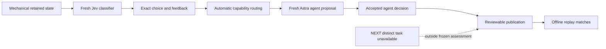

# Classifier-to-specialist chain

This note records the actual mechanical → Jev → configured-specialist chain prepared from the retained Radstock–Midsomer Norton planning state. It is a bounded evidence record, not a claim of planning-quality improvement. The specialist step is an actual saved `gpt-6-astra` Medium assessment through the configured `codex-agent-bridge`; it is not a standalone API integration.

## Finding

A fresh `jev-latest` request was dispatched once through TypeSafe and resolved to `jev-1.13.0`. Its exact saved exchange was fed into the runtime branch without editing the response. The runtime then selected the next capability automatically and created a structured specialist task for `codex-agent-bridge`; no operation or unresolved result was forced. A fresh Astra assessment of that task proposed selecting the existing low-traffic candidate while preserving its unknown provision state.



## Fresh Jev result

The model-visible task offered four admitted alignment IDs plus investigation outcomes: `__needs_evidence__` (request evidence before selecting), `current-future-provision` (request route-section evidence for current provision, cycling access and continuity, or explicit future intervention), `__unknown__` (record an unknown and continue review), and `__none__` (record that no supplied option is adopted). Its instruction was to choose one admitted planning option or an explicit unresolved outcome. Jev chose `current-future-provision` with probability `0.36`, narrowly above generic `__needs_evidence__` at `0.35000000000000003`; confidence was `0.26`. These are recorded model outputs, not a threshold, gate, safety measure, or route-quality score. Other candidate probabilities remain in the saved summary. The response was HTTP 200 from actual model `jev-1.13.0`, requested as `jev-latest`, with 19,378 input and 346 output tokens. The exact response was reused as the classifier feedback that triggered the next structured task.

The exchange is bound by semantic request `545c2783fcfaad813e6e2d2e9a8648ef8f4a1189cd0c37885f13e635305aa8dd`. Its saved exchange hash is `e6148e34f3048302aca7569e029e6c49a247c78738b5d24e68889b0375b011af`; request-body hash is `b2c4274ba0b7a4e73344392fb11511ddd43c002c3d030693587b67b7d64c24a3`; response-body hash is `5491189ee012f659fbd64ab53139ddf45f856edd93c6565e04108f3670b9a8f8`. No credential value was recorded.

## Automatic routing and Astra proposal

The copied branch retained checkpoint `52bd65d4376f858ee72d752bbbf3a9200ef0be1fea8a6026f19273c657381bc9` and preserved main head `083eb9365f1a4793dae3c60d1b00e84dbcde219747ed4bd02a21f6470b4cd2dc`. The routing record identifies capability `codex-agent-bridge`, task `planning-judgment-2f3f3e570df5b8dd5a299110`, and a structured proposal task. The task was captured before application; its prepared receipt says `provider_dispatch: false`. That capture is routing evidence, not the Astra judgment itself.

The actual saved Astra assessment proposed:

```json
{
  "kind": "select-alignment",
  "payload": {
    "candidate_id": "planning-candidate-6d4a4004bf6e378682beed8b343eadf8ba7b5dbfc6b52742c9b6c9ad80034038",
    "obligation_id": "evaluation-radstock-midsomer-norton"
  }
}
```

The Astra proposal targets the admitted `low-traffic` path: 20 directed edges, 2.8533572126233944 km, A-road share `0.04384141439395629`, `ncn_share: 0.0`, empty `source_corridor_refs`, and `current_or_future: unknown`. The proposal preserves mandatory A-road accounting and does not assert whole-route existing provision, access, continuity, safety, adoption, or route quality. The shorter direct candidate and the strategic-spine candidate remain material alternatives; ncn-informed duplicates the direct path in the frozen packet.

The specialist received the official supplementary bundle listed in `specialist-input-manifest.json`, including the Council Greenway note and publisher captures. This context was available to Astra only; it was not appended to Jev input. It supports route-level and matched-section context without converting the whole candidate to current provision. The supplementary evidence and limits are described in the prior [Greenway specialist bridge](greenway-specialist-bridge.md).

## Application and replay

The repaired runtime accepted the saved proposal as an `agent` decision with event `0306c4a82a095bda92285bb4c517ae552359340916d0fc9755f3ae308be21c39`, receipt `7e6de0cbf3cbe82847c73f48dbb9f85cad9377cd8f6cb36df9002363bbeb51c1`, and context artifact `859e037feea0d61f5974206a8ee67f25b2900f460297456ac21957d2b786a1f1`. The accepted operation is the saved `select-alignment` proposal. The application matched the frozen model-visible input hash `749a57f666433a57e297d948b9f02561cb2ca5c7b668da407ff7286e96315928` despite operational task and branch identifiers differing. The proposed candidate's graph path and source bindings remained unchanged, `current_or_future` remained `unknown`, and one alignment was selected. Main head `083eb9365f1a4793dae3c60d1b00e84dbcde219747ed4bd02a21f6470b4cd2dc` was preserved.

Publication is `reviewable-incomplete` because a distinct NEXT task outside this frozen assessment was explicitly unavailable. That later termination does not make the accepted Astra selection fail. Public replay matched the returned problem and state, and the raising provider was unused. The initial application/helper attempt omitted the router and failed before applying; the repaired run applied the saved assessment without additional inference. This chain demonstrates classifier feedback, automatic specialist routing, accepted application and replay; it does not demonstrate a planning-quality improvement from either model.

## Reproducibility and retained refs

The experiment root is `build/typesafe-experiments/2026-09-21-classifier-specialist-chain/`. Essential content-addressed artifacts are:

| artifact | SHA-256 |
| --- | --- |
| `execution-protocol.md` | `751e1867b1caa844ef26741b45e9d205853f940d342e0c4bcb29cf1cc70eed06` |
| `jev-summary.json` | `6b595e157ef100e3e1e6fc2883a25bbba0feccadb17757d9928dd53dcef90cfa` |
| `escalation-history-refs.json` | `f8e501465dd7fe25aa64375d9da2fe58c833dff76dd9a02a0963c088b280d73f` |
| `specialist-input-manifest.json` | `ed98b080e89cab195522a6f1fe88024b572afef522c6aa1369a63a744179ea85` |
| `chain-astra-assessment.json` | `4836e445efbe153e6534610296643ba9f40e22091b4cec0582aa20c0e8ee35dc` |
| `chain-astra-assessment.md` | `843405d33a0f369a0c6cb884d44f6677b38ed3c0d9400ea6d64a9ffd3038c5e6` |
| `escalation-specialist-task.json` | `193cc25166ee3c51ba3d069016df250ebe3957598dc7bc6ef01ac772503afa50` |
| `escalation-specialist-binding.json` | `baaf050495eba04752686b49b7b02e3fde2532749bdfbc3db6cdff2b85cd3c2d` |
| `application-repaired/result-summary.json` | `544b0a7f988d5fedd59d3f6a3858492ecde831c4f1a3d4203b8eaf0dcad9fcc8` |
| `application-repaired/replay-summary.json` | `9e269f647759528c6ad5a04bfe161e351bcd43e3cb6ba2bbd7a51b59dd71c13d` |

This evidence note adds no raw SATN packet export, API key, or bulk runtime artifact. Reproduction uses the retained experiment paths and hashes above; it does not imply another provider call or automatic retry.
