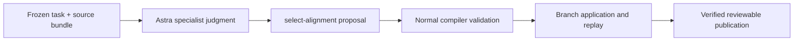
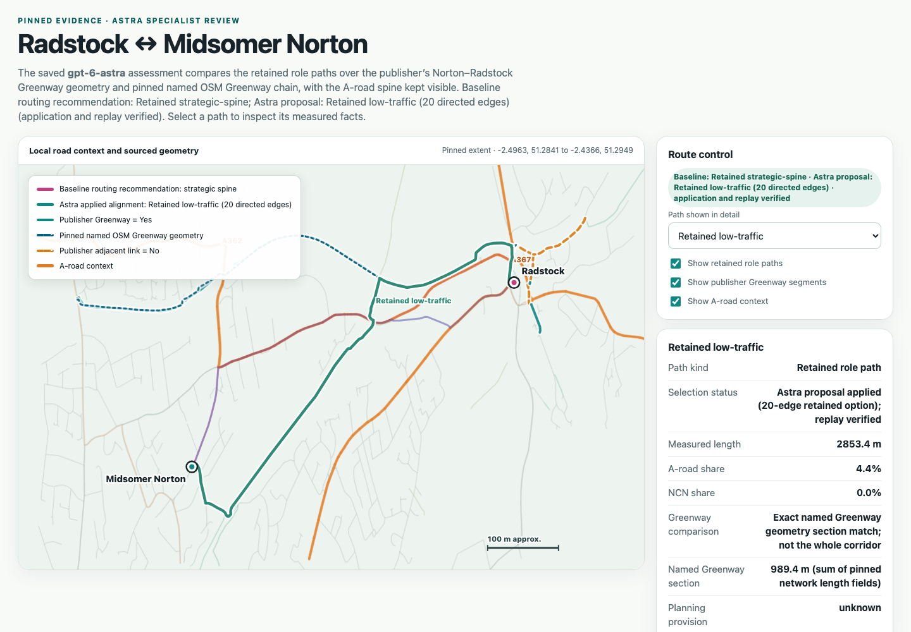

# Greenway specialist bridge assessment

This note records the actual specialist assessment prepared for [Choose an actionable focused judgment from bound route evidence](https://github.com/awjreynolds/agentic-satn-compiler/issues/501). It is a saved `gpt-6-astra` assessment at Medium reasoning through `codex-agent-bridge`, using the frozen task and source bundle. It is a bridged specialist judgment, not a standalone live API response or field finding.

## Captured judgment

Astra proposed this permitted operation:

```json
{
  "kind": "select-alignment",
  "payload": {
    "candidate_id": "planning-candidate-6d4a4004bf6e378682beed8b343eadf8ba7b5dbfc6b52742c9b6c9ad80034038",
    "obligation_id": "evaluation-radstock-midsomer-norton"
  }
}
```

The proposal provisionally selects the existing `low-traffic` Radstock–Midsomer Norton candidate. It keeps `current_or_future: unknown`, the 20-edge path, the recorded length of `2.8533572126233944` km, and the empty `source_corridor_refs` unchanged. Its rounded comparison is 2.853 km and 4.38% A-road share, versus 2.525 km and 67.84% for `direct` and 2.614 km and 85.26% for `strategic-spine`. Exact values remain in the frozen `decision-task.json` and `astra-assessment.json` artifacts referenced below. The specialist judged the named-corridor opportunity worth carrying forward despite the longer path. This is a provisional comparative judgment, not a configured weight, safety finding, route-quality proof, or whole-candidate existing-provision claim.

The frozen brief permits this reviewable proposal while retaining unresolved facts.

The supplied Greenway evidence mechanically binds only the supplied geometry and source context. The candidate path contains two matched graph edges corresponding to the Greenway geometry: `22932248,1361731394,261241204#03a0feb6137c1011b963` and `26624188,261241204`. The Council source describes the named Norton–Radstock Greenway as existing traffic-free cycling provision, and seven publisher records provide matched section context. Those facts do not establish the remaining candidate sections, endpoint access, transitions, condition, gradient, or social safety. The source note remains the authority for the route-level description and its limits; see [Norton–Radstock Greenway provision evidence](norton-radstock-greenway-sources.md) and [Greenway candidate coverage](greenway-candidate-coverage.md).



## Alternatives and scope

The specialist considered the shorter `direct` candidate (`2.5247365700451523` km), the `strategic-spine` candidate (`2.6139796928980035` km), and the `ncn-informed` candidate, which duplicates the direct path in this packet. The shorter alternatives remain material; A-road share is not treated as a safety proxy. Mandatory A-road accounting is retained, and no departure, exclusion, or no-loss decision is made. A focused transition/access investigation remains a valid follow-up, especially near the point where the path leaves the named Greenway.

### Unknowns retained

Current cycling access, condition, protection, continuity of the remaining candidate edges and transitions, endpoint attachments, gradient, comparative social safety, and independent access remain unresolved. The endpoint attachment distances do not prove accessible connections. The candidate covers only part of the named Greenway, and publisher attributes remain limited to their matched records.

The earlier Jev evidence established a bounded source-claim classifier over supplied passages. Its source-matched comparison returned the same generic `__needs_evidence__` action in control and treatment and made no route selection, so it did not demonstrate a Jev contribution to this choice. This Astra result is an agent-origin specialist proposal comparing concrete retained candidates; it is not automatic Jev escalation, and it does not establish downstream route quality. See [Pinned TypeSafe planning evaluation conclusion](typesafe-pinned-evaluation-conclusion.md) and [TypeSafe follow-up comparison](typesafe-followup-comparison.md).

## Runtime application and replay

The normal runtime accepted the saved proposal as an `agent` decision with event `9bd7456cdcde4846b5f91a680418af3ede517ffe419c2eb8653d3564bc4bf255`, receipt `6889acd6daa5d5117d45172476af80dde58f1f348f84de6ce8af7dfd4a222db7`, and operation `select-alignment`. Focused validation confirmed the exact response and frozen-context hashes and receipt contents. The selected candidate's graph path, source bindings, and `current_or_future: unknown` value were unchanged. The application preserved the original main head `083eb9365f1a4793dae3c60d1b00e84dbcde219747ed4bd02a21f6470b4cd2dc` and published a `reviewable-incomplete` result.

Public replay with a raising adapter was also verified: the adapter was not called and replay matched the returned problem and state. A subsequent `provider-unavailable` termination belongs to a distinct task outside this frozen assessment; it is not a failed selection. The publication pointer and output fingerprint are retained in `application/result-summary.json`. This application proves acceptance, preservation, publication and replay of the specialist proposal; it does not prove route quality, safety, access, or current provision.

## Frozen evidence

The retained experiment root is `build/typesafe-experiments/2026-09-20-greenway-specialist-bridge/`.

| artifact | SHA-256 |
| --- | --- |
| `assessment-input-manifest.json` | `1796ef3d11f6be7292c97703933c81563cdfc4c2f185099b8fef42c5ca1ed95b` |
| `decision-task.json` | `a0ae2d52c7fdd592022720b02276626cdf70bde40d1aab402dbde91387581e42` |
| `protocol.json` | `10dca19de402ceabe3fbcc4159e2ff2592b33f022fbc87ce127250d3b21c4636` |
| `source-bundle/manifest.json` | `fe01ce4623994556da6cf77eff88cee2e80ad5a6316cfba2f065353c3c29127c` |
| `astra-assessment.json` | `3e6774235a25a5e67410850e138d13d409fe3ba9e8f02ab400db4023755dbca1` |
| `application/result-summary.json` | `da174d8badc6eaf2e85008b6ab0cb02af0b56cba2e897b4074be7abd7c9bd134` |
| `application/replay-summary.json` | `d98826383e92f3682027bba15fb9999122cbf8996e25b5e9d2c1bb8a16533465` |

The frozen task is `planning-judgment-42f1deea29839d9430d63860`; its assessment manifest reports all input hashes verified. The preparation fork used parent main head `083eb9365f1a4793dae3c60d1b00e84dbcde219747ed4bd02a21f6470b4cd2dc` and checkpoint `52bd65d4376f858ee72d752bbbf3a9200ef0be1fea8a6026f19273c657381bc9`. Preparation recorded no provider dispatch; that unavailable preparation receipt is not the Astra judgment. The actual saved assessment records `provider: codex-agent-bridge`, `model: gpt-6-astra`, and proposal-only validation status; the application and replay facts above are recorded separately. This remains an actual saved Astra agent bridge, not automatic Jev escalation or a standalone API integration.

## Offline map artifact

The focused offline map compares all four retained role paths, the exact publisher Greenway geometry, the pinned named OSM Greenway section, and visible A-road context. It shows the saved Astra `select-alignment` application on the existing 20-edge low-traffic candidate with replay verified; planning provision remains `unknown`.



The standalone bundle is `build/typesafe-experiments/2026-09-20-greenway-specialist-review-map/`. Focused rendering checked the 1440×1000 desktop and 390×844 mobile layouts, route selection, source-layer toggle, both endpoint labels, and no horizontal document overflow.
