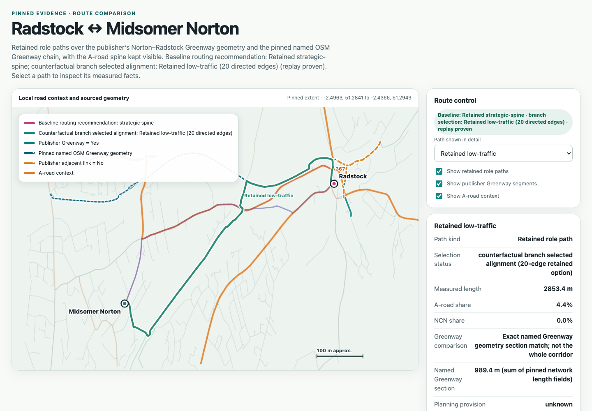

# Pinned TypeSafe planning evaluation conclusion

This decision record applies the agreed [Design experiments that test real network-planning judgment](https://github.com/awjreynolds/agentic-satn-compiler/issues/442) evaluation rubric to the
pinned B&NES experiments. It separates what the compiler delivered from what
Jev demonstrated. It does not claim route quality, feasibility, adoption, or
that Jev is useless because those qualities were not observed.

## Decision

Keep the implemented source-claim classifier seam and its optional planning
role. Do not rewrite routing, alter route weights, or repeat generic inference
on the current evidence. The experiments show a useful typed semantic
judgment over supplied source context, while downstream planning benefit and
route quality remain unproven.

The compiler delivered the surrounding contract: pinned evidence and source
inventory admission, named-place connection expansion, typed Jev decisions,
history and replay, branch preservation, failure diagnostics, incomplete
publication, and map projection. The original Jev-driven planning runs did not
select an alignment. They recorded evidence requests or semantic no-progress,
while the checkpoint experiment demonstrated a live judgment from a retained
state and preserved its parent branch. A later bounded counterfactual selected
an existing candidate by one mechanical operation; that demonstrates replay
and publication behavior, not that the selected network is good.

## What Jev demonstrated

The source-claim classifier ran nine constructed semantic cases over three
official B&NES contexts. All nine selected labels matched the withheld
source-derived references: three `supports`, three `contradicts`, and three
`does_not_establish`. This is evidence that the typed, source-linked classifier
seam can interpret supplied passages in a bounded packet. It is not
representative accuracy, field ground truth, calibration, or proof of current
provision. The close `claim-03` distribution remains visible rather than being
treated as certainty.

The source-matched follow-up compared two otherwise-identical packets differing
only by the retained judgment. Both arms chose
the generic `__needs_evidence__` action. Control returned probability `0.42`
and confidence `0.33`; treatment returned probability `0.39` and confidence
`0.30`. Treatment added 1,296 input tokens. The action was unchanged, so this
run observed no downstream benefit from retaining the judgment. The small
probability shift is not evidence of quality or causality. The run made no
route selection and no integrated-runtime or replay claim.

The Greenway evidence further narrows the interpretation. The named
low-traffic traversal is present in the retained graph/source comparison, while
the admitted `greenway-cycleway` category has no intersection with the four
endpoint paths. Empty `source_corridor_refs` limits candidate provenance; it
does not establish a missing candidate. The source evidence binds the named
Norton–Radstock route to route-level existing provision, but not every feature's
current condition or accessibility.

## Issue 442 rubric

| Rubric question | Pinned evidence | Conclusion |
| --- | --- | --- |
| Continuity and transitions | Deterministic graph paths, endpoint provenance, and geometry checks are retained; real Jev runs did not select a route. | Compiler validation is delivered. A planning-quality claim needs section-specific continuity and every material transition assessed for the chosen option and alternatives. |
| Directness | Candidate lengths and role measurements are retained as comparison fields. | Measurements do not establish a preferred or higher-quality route. |
| Elevation coverage | Available evidence has not established comparative gradient assessment for route quality; coverage remains unknown. | Unresolved; no comparative elevation judgment is demonstrated. |
| Social safety and independent access | The pinned evaluation records these as unknown, with no human assessment. | Unresolved; no safety or access claim is supported. |
| Current provision versus future work | Official source evidence supports route-level existing Greenway provision; proposed links remain future intent, and exact-match geometry/provenance are code responsibilities. | Semantic source interpretation is promising, but coverage, continuity, condition and access remain claim-specific. |
| Decision accountability | Jev responses, source scope and operation history are retained; no Jev-driven alignment was selected. The later mechanical counterfactual is reported below. | No evidence-backed route trade-off was adjudicated. A remaining material trade-off requires owner/policy adjudication, not invented ground truth. |
| Replay and branching | Recorded replay, checkpoint fork, parent preservation and incomplete publication are demonstrated. | The compiler contract is evidenced; this does not imply planning quality. |

Exact source matching, geometry identity, endpoint continuity, transition
accounting, and publication invariants belong to deterministic compiler code.
Jev can interpret a supplied claim or compare supplied choices; it cannot make
missing route evidence, geometry, access, or policy authority appear.

## What a stronger quality claim still needs

Evidence requirements depend on the claim. A whole-route choice or quality
adjudication needs the relevant candidate sections, material transitions and
applicable issue 442 criteria assessed. A narrower source-semantic claim needs
the evidence for that claim and may retain other dimensions as unknown. The
available evidence gaps in this pinned case are:

- section-specific continuity and transition evidence;
- available bound route-elevation/profile evidence with explicit coverage limits;
- observed social-safety and independent-access evidence;
- current-provision evidence tied to the relevant source sections; and
- an accountable owner or policy adjudication where the evidence leaves a
  material trade-off.

Claims depending on missing evidence remain unresolved; bounded comparisons may
retain explicit unknowns. Constructed labels, source names, route designations,
probability shifts, or a model explanation cannot substitute for the evidence
needed by a specific claim.

## Counterfactual result

The bounded [Replay a counterfactual choice of the existing Greenway option](https://github.com/awjreynolds/agentic-satn-compiler/issues/494)
completed with exit code 0. From a pre-decision checkpoint of `main`, it
forked `greenway-counterfactual`, replayed the retained state, and applied one
mechanical `select-alignment` operation to the existing 20-edge low-traffic
candidate. The result was `reviewable-incomplete`; its
`current_or_future` value remained `unknown`, its 2.8533572126233944 km path
and candidate metrics were unchanged, and no source-corridor references were
enriched or new route created.

The recorded child event is
`01370f399a2d47ce70d1d71344e1a11ef7108adb16120d0b1727806dd870335c` and the
parent `main` head `083eb9365f1a4793dae3c60d1b00e84dbcde219747ed4bd02a21f6470b4cd2dc`
was unchanged. Offline replay matched the result assertions. The comparison
reports `changed_artifacts: []` and replacement of the prior head event on the
counterfactual branch. The result summary and publication pointer carry the
new output fingerprint
`9bae04387d206910e551c4b4e1b5e21a7d6b15aa2aec0a93b33b04e0e8cb3a91`.
Publication artifact hashes match its manifest.

The input history came from the retained
`2026-09-19-live-poc-alignment-resume-v2/history` copy. Independent comparison
found all 46 non-lockfiles byte-identical to
the inherited copy, including the retained main head; because no pre-copy
manifest exists, this is byte-comparison evidence rather than a before/after
source-hash attestation.

The generated [counterfactual review map](/Users/awjre/Work/banes-satn/build/typesafe-experiments/2026-09-20-greenway-counterfactual/publication/publications/proposal-state-5a59b3c713f9d333a50c350f32e68c46f65a05373d1c6e487bf8f4f3e7882972-9bae04387d206910/review-map/index.html)
is a review projection, not evidence of an optimal route. The separate
[interactive comparison](/Users/awjre/Work/banes-satn/build/typesafe-experiments/2026-09-20-greenway-review-map/index.html)
shows the retained options, exact Greenway section and A-road context. Its
route-selection and source controls passed desktop/mobile browser checks.

## Evidence basis

This conclusion is grounded in the [pinned planning evaluation](typesafe-planning-evaluation.md), [source-claim classifier](typesafe-planning-claim-classifier.md), [follow-up comparison](typesafe-followup-comparison.md), [Greenway coverage evidence](greenway-candidate-coverage.md), [Norton–Radstock source evidence](norton-radstock-greenway-sources.md), and [TypeSafe planning contract](../typesafe-planning.md).
