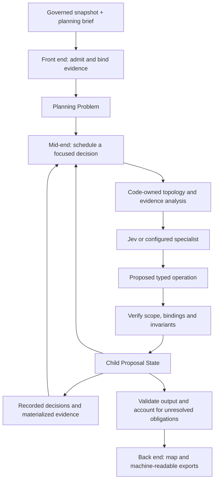

# Experimental TypeSafe compiler

The planning path separates evidence admission, network decisions and publication. Compiler stages and intelligence capabilities are separate concepts: code, Jev and a configured specialist participate where their capabilities fit the task.

Each recorded planning decision carries a `decision_class`, independently of its compiler stage and event kind:

| Decision class | Meaning |
| --- | --- |
| `mechanical` | Deterministic rules, computation, admission or validation. |
| `classifier` | A typed Jev judgment over the supplied evidence and choices. |
| `agent` | A proposal from a configured reasoning or specialist capability. |

The actual provider and model identity remain recorded alongside this class. The compiler derives the class from the capability that performed the work; a response cannot grant itself a different class. Mechanical validation of a classifier or agent proposal records the validation separately and preserves the proposal's original class.



## Stage contracts

| Boundary | Responsibility | Required proof |
| --- | --- | --- |
| `build_planning_problem` | Lower the pinned snapshot and explicit brief into source corridors, named places, obligations and retained geometry/topology facts. | Every in-scope A-road remains accounted for, including source-only corridors. Source designation never proves usability. |
| `apply_operation` / `admit_expansion` | Accept only a permitted transformation of the correctly bound parent state. | Check identifiers, task scope, evidence, geometry, topology and policy; reject stale or fabricated bindings. |
| `PlanningRuntime` | Schedule decisions and record their exact inputs and outcomes. | Persist the task packet and started attempt before dispatch; feed current decisions and unknowns into later tasks; stop on genuine semantic no-progress. |
| `validate_proposal` | Produce the output contract and truthful completeness status. | A selected obligation needs an admitted selection or connection proof. Missing evidence remains explicit. |
| `project_planning_output` / `publish_planning_output` | Lower validated state into presentation and an immutable artifact bundle. | No new selection or departure decisions; verify output identities and artifact closure before moving the current pointer. |

The proposal is the sole authority for selected alignments. A-road source membership does not force its exact alignment into the proposal. A deliberate full or partial departure requires affected original geometry, evidence, reason and an explicit alternative or unresolved/no-loss outcome. An alternate outcome refers to an already selected admitted alignment. The default map must show the affected source sections prominently, with branch attribution and accessible legend text. Unknown provision is distinct from current provision and future work.

## Applying compiler design principles

SATN's intermediate representations describe a planning problem and a proposed network. Transformations may deliberately change the proposal; they must preserve the brief, governed evidence and mandatory source accounting. Structural and reference checks precede semantic and geometry checks, following the ordering described by [MLIR's operation verification](https://mlir.llvm.org/docs/DefiningDialects/Operations/#verification-ordering).

Analyses compute facts without choosing a new network. Transformations consume those facts and explicitly change state. Derived results may be reused only under their recorded dependencies, following the separation of transformations and preserved analyses in [LLVM's pass manager](https://llvm.org/docs/NewPassManager.html). A configured model can propose an operation but cannot upgrade missing evidence, widen its task scope, or create policy authority.

Failures retain diagnostics and the prior valid state/publication. The retained input, request, response and operation allow the failing decision to be reproduced, paralleling [MLIR's pass failure and reproducer mechanisms](https://mlir.llvm.org/docs/PassManagement/#crash-and-failure-reproduction). These principles are applied directly to the existing Python implementation.

## Replay and new decisions

Recorded replay consumes retained operations and expansion receipts without model calls, source reloads or retrieval. A fork begins before the selected decision; an explicit advance validates the replayed prefix and applies a replacement on the child branch. Changed evidence or policy requires a new binding and invalidation of affected descendants. The original pinned branch remains intact.

A fresh model call may produce a different judgment. Therefore reproducibility means reproducing the recorded compilation from its receipts, not expecting another inference to repeat the same answer. Branch comparison shows changed decisions and dependent results; ancestry alone does not prove that one decision caused a real-world failure.

## Review and evaluation evidence

Implementation and review evidence are tracked in [the rebuild epic](https://github.com/awjreynolds/agentic-satn-compiler/issues/450). The protected historical version is `PreTypesafe`. Focused fixtures establish state, departure-map and replay behavior; the separate pinned B&NES experiments establish what happened on real inputs. Neither establishes feasibility, adoption or an optimal network. Live specialist behavior requires a configured adapter; protocol fixtures must be identified as fixtures.

## Experimental CLI

Use an explicit history directory and a separate output directory for each experiment. `satn plan run CONFIG --root HISTORY --output-root OUTPUT` performs deterministic admission by default. This retains source obligations and unknowns; it is not an intelligently selected network.

For a configured live Jev run, add `--mode live --connection-options OPTIONS.json`. The options file supplies admitted named-place connections; the experiment runner derives their identifiers from the pinned input. Supply `TYPESAFE_API_KEY` through the environment rather than command-line arguments or tracked files. A live run does not imply that a specialist is configured.

To opt into one-shot Codex reasoning for an unresolved, scoped judgment, provide both explicit specialist settings on the ordinary run command:

```text
satn plan run CONFIG --root HISTORY --output-root OUTPUT --mode live \
  --specialist-model gpt-5.6-luna --specialist-reasoning-effort max
```

The run registers the existing Jev classifier and a `codex exec` specialist in the static capability router. Codex receives the frozen task through stdin and must return one strict JSON proposal; the existing planning operation validator checks its scope and payload before applying it. The process is invoked once with read-only sandboxing, an ephemeral session, and no repository check. The exact task and final JSON response are retained as receipts, with requested and observed model identity kept separate. Deterministic runs and runs without both specialist options keep their existing behavior.

```text
satn plan verify HISTORY --branch main
satn plan replay HISTORY --branch main
satn plan fork HISTORY CHECKPOINT --branch alternative
satn plan advance HISTORY OPERATION.json --branch alternative --expected-head HEAD --output-root ALTERNATIVE_OUTPUT
satn plan compare HISTORY --base-branch main --branch alternative
```

`fork` selects a retained pre-decision checkpoint. `advance` consumes an explicit typed operation against the replayed child state; it does not silently rerun inference. Inspect the recorded state and head when constructing the replacement. The output directory contains `run.json`, `proposal.json`, immutable `publications/<output_id>/review-map/index.html`, and `current.json`. Serve the publication directory to review its map and machine-readable exports.

## Architectural review

The implementation review traced the actual boundaries: `planning_engine` admits the snapshot and owns the planning IR and verified transformations; `planning_runtime` schedules and records judgments; `planning_publication` projects validated output and protects publication identity. Compiler stage and decision class are independent. The core has no provider, runtime or publication imports, and the publisher does not choose routes or call providers.

Independent review reproduced and verified fixes for geometry identity, expansion receipts, parent binding, semantic no-progress, obligation completeness, scoped specialist proposals, expanded-checkpoint replay, current-state feedback and multiple connection scheduling. Publication reproductions verify stale-output rejection and preservation of the last valid pointer when a historical bundle is damaged. Browser evidence verifies default full/partial departure geometry and matching legend styles. Focused tests are recorded in the stacked PRs; this was a bounded architectural and contract review, not a claim that every legacy compiler path was audited.

## Metadata retention contract

This is a proof of concept. Keep retention within the existing JSON history
store and verify the behaviors needed for the experiment: typed decisions,
resolvable references, replay and branching.

Retain the exact redacted model request and response alongside references to the
immutable evidence and derivation that produced them. Shared evidence, problem
data and exchanges belong in content-addressed records; histories, operations
and summary reports should refer to those records instead of embedding repeated
full copies. Verification may reuse an immutable record already checked within
that operation, while later operations must still detect tampering. Existing
recorded histories remain readable.

Origins, destinations and edges (roads or routes) are stable domain inputs;
callers do not supply versions for those shapes. Changed input data changes its
content fingerprint, not a schema version. Model-facing projection is
deterministic: identical complete semantic inputs—including evidence, policy
and relevant prior decisions—produce the same canonical packet and choice
mapping. Compiler revision and transformation identity are internal audit
provenance, separate from domain inputs. Request identity, model identity and
derivation provenance remain auditable. Fresh inference is still distinct from
replaying a recorded judgment.

Normalized responses retain the typed outcome and its uncertainty: a Choice
selection and probability/confidence data, a Noul `pYes`, or a Score value and
probability/confidence data. Bind each result to its question, input fingerprint
and actual model. Confidence alone cannot reconstruct a decision. Store the
exact exchange once; derive compact operational views from it.

The initial approved live case retained 955,043,513 bytes across 30 files for two
Jev responses using 4,333 input and 134 output tokens. This observed baseline
motivates the retention work in [issue #465](https://github.com/awjreynolds/agentic-satn-compiler/issues/465);
it is not a storage quota or performance target. Report before/after storage and
replay measurements alongside preservation of the audit and branching contract.

A like-for-like deterministic Bath/Saltford fixture with one requested connection
used 3,320,374 bytes before this change and 1,979,114 bytes after (40.39% less).
History fell from 1,664,983 to 586,894 bytes; `run.json` fell from 293,550 to
29,325 bytes. Verification reads fell from 72 to 26 and replay reads from 109 to
26, with 26 unique records in each case. Problem/state retrieval and replay
remained exactly equal. These are fixture measurements, not projections of live
B&NES performance.

## Live API compatibility in the POC

A live Choice response supplied all offered options with finite in-range
probabilities totaling 0.99. The selected option and confidence were usable.
The POC preserves those values and accepts the typed Choice without requiring
an exact probability total; it does not renormalize the provider response.
The original receipt remains available. This compatibility behavior applies to
Choice; Score handling is unchanged.
